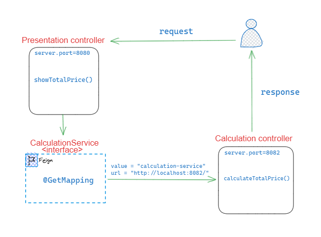

# 🚩 Feign Client

**Feign ve RestTemplate, mikro servis tabanlı uygulamalarda diğer mikro servislere HTTP istekleri göndermek ve cevapları almak için kullanılan iki farklı yöntemdir. Her ikisi de Spring Cloud gibi mikro hizmet mimarilerinde kullanılan araçlardır. İşte Feign ve RestTemplate arasındaki farklar, avantajlar ve kullanım amaçları:**

## 🎯 **RestTemplate:**

1. **Spring Framework tarafından sağlanan temel bir HTTP istemci kütüphanesidir.**
2. **Düşük seviyeli olarak daha fazla yapılandırma gerektirebilir.**
3. **İstekleri manuel olarak yapılandırmanız ve yönetmeniz gerekir.**
4. **RestTemplate, her isteği ayrı ayrı tanımlamak ve yönetmek için daha fazla kod gerektirebilir.**
5. **Mikro servisler arasında iletişim için daha genel ve esnek bir araçtır.**

## 🎯 **Feign**:

1. **Spring Cloud tarafından sağlanan bir deklaratif HTTP istemci kütüphanesidir.**
2. **Anotasyon tabanlıdır ve kullanımı daha basit ve tanımlamalar daha açık ve sade olabilir.**
3. **Servis arayüzlerini tanımlayarak istekleri ve cevapları yönetebilirsiniz.**
4. **Feign, arka planda otomatik olarak isteklerin oluşturulmasını ve yönetilmesini sağlar. Bu nedenle daha az kod yazmanız gerekebilir.**
5. **Mikro servisler arası iletişimi daha özelleştirilmiş ve belirli servisler için optimize edilmiş bir şekilde gerçekleştirmenizi sağlar.**

## 🎯 🔴 **Farklar:**

- **RestTemplate, Spring Framework'un genel bir bileşeni olarak daha genel ve esnek bir yaklaşım sunar. Feign ise Spring Cloud'un mikro servislerin özel ihtiyaçlarına yönelik daha özelleştirilmiş bir çözümüdür.**
- **Feign, servis arayüzlerini anotasyonlarla tanımlayarak kodu daha düzenli ve anlaşılır hale getirirken, RestTemplate daha düşük seviyeli ve manuel bir yaklaşım sunar.**
- **Feign, Eureka gibi servis keşif (discovery) çözümleriyle daha iyi entegre olabilir ve bu sayede servis adları dinamik olarak çözümlenebilir.**
- **Feign, servisler arası isteklerin otomatik olarak dengelemesini ve yük dengelemesini (load balancing) sağlamak için hızlı bir şekilde entegre edilebilir.**

## 🎯 🟢 **Avantajlar:**

- **RestTemplate:**
    - **Geniş bir işlevsellik sunar ve genel durumlar için kullanışlıdır.**
    - **Daha fazla yapılandırma ve manuel iş gerektirebilir.**
- **Feign:**
    - **Anotasyon tabanlı tanımlamalar sayesinde kodun daha düzenli ve anlaşılır olmasını sağlar.**
    - **Servisler arası iletişimi kolaylaştırır ve hızlıca entegre edilebilir.**
    - **Eureka gibi servis keşif çözümleriyle uyumlu olarak çalışarak servis adlarını dinamik olarak çözer.**

## 🎯 **Kullanım Amaçları**:

- **RestTemplate: Genel ve esnek bir HTTP istemci ihtiyacı olan durumlar için uygundur. Farklı mikro servislere yapılan isteklerde farklı yapılandırmalar gerekebilir.**
- **Feign: Özellikle mikro servisler arasında yapılan isteklerin daha basit ve anlaşılır şekilde tanımlanmasını istediğiniz durumlarda uygundur. Servis keşif çözümleriyle kolayca entegre edilerek dinamik servis adı çözümlemesi yapabilirsiniz.**

**Hangi aracın tercih edilmesi gerektiği, projenin gereksinimlerine ve mikro servis mimarisinin karmaşıklığına bağlı olarak değişebilir.**

## 🎯 **Projeye Genel Bakış**:

